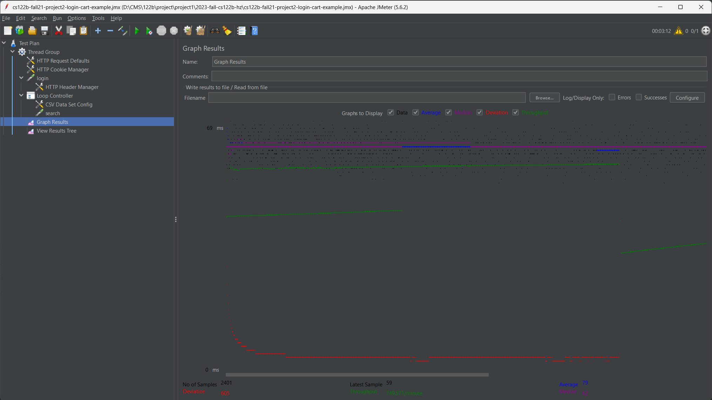

- # General
    - #### Team#:

    - #### Names: Weiyu Hao, Pengpeng Zhang

    - #### Project 5 Video Demo Link:https://www.youtube.com/watch?v=cjEKGMn0NzM

    - #### Instruction of deployment:

    - #### Collaborations and Work Distribution: Pengpeng Zhang-Connection Pooling&Jmeter

- # Connection Pooling
    - #### Include the filename/path of all code/configuration files in GitHub of using JDBC Connection Pooling.
    - configuration: ./WebContent/META_INF/context.xml
    - code using it: all java files under ./src with connection to database

    - #### Explain how Connection Pooling is utilized in the Fabflix code.
    - In the Fabflix code, when a connection is required by servlet, it will try to find an idle connection in the pool and use it. If there is no idle connection, a new connection will be established(not exceeding the maximum defined in context.xml). If total number exceeds the idle connection, the idle connections will be closed. 

    - #### Explain how Connection Pooling works with two backend SQL.
    - With two backend SQL databases, connection pooling typically involves maintaining separate pools for each database. Each pool operates independently, managing connections to its respective database. When an application requires data, it determines the appropriate database, then retrieves a connection from the corresponding pool. This separation ensures that connections to each database are efficiently reused without interference, while still allowing the application to balance load and resources between the two databases as needed.

- # Master/Slave
    - #### Include the filename/path of all code/configuration files in GitHub of routing queries to Master/Slave SQL.

    - #### How read/write requests were routed to Master/Slave SQL?

- # JMeter TS/TJ Time Logs
    - #### Instructions of how to use the `log_processing.*` script to process the JMeter logs.
    - Put the file path in the file_path varible in line 1 and run the script

- # JMeter TS/TJ Time Measurement Report

| **Single-instance Version Test Plan**          | **Graph Results Screenshot**             | **Average Query Time(ms)** | **Average Search Servlet Time(ms)** | **Average JDBC Time(ms)** | **Analysis**                                              |
|------------------------------------------------|------------------------------------------|----------------------------|-------------------------------------|---------------------------|-----------------------------------------------------------|
| Case 1: HTTP/1 thread                          |                        | 60                         | 2.46                                | 1.77                      | it's fastest becuase workload is small                    |
| Case 2: HTTP/10 threads                        |  | 65                         | 4.72                                | 4.29                      | takes longer time than case 1 because larger worklaod     |
| Case 3: HTTPS/10 threads                       |                | 104                        | 3.74                                | 3.35                      | more time spent on encryption and https related mechanism |
| Case 4: HTTP/10 threads/No connection pooling  |                | 71                         | 5.30                                | 4.11                      | slower than case 2 as without pooling                     |

| **Scaled Version Test Plan**                   | **Graph Results Screenshot** | **Average Query Time(ms)** | **Average Search Servlet Time(ms)** | **Average JDBC Time(ms)** | **Analysis**                                      |
|------------------------------------------------|------------------------------|----------------------------|-------------------------------------|---------------------------|---------------------------------------------------|
| Case 1: HTTP/1 thread                          |    | 79                         | 5.20                                | 4.66                      | maybe small workload wasting time on proxy        |
| Case 2: HTTP/10 threads                        |    | 72                         | 2.33                                | 2.02                      | faster excution time because of parallel mechines |
| Case 3: HTTP/10 threads/No connection pooling  |    | 68                         | 4.20                                | 3.20                      | slower excution as without pooling                |
